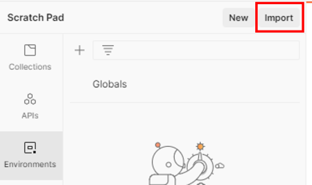

# GitLab-Umgebung
Jedes Team hat einen [eigenen Bereich in GitLab](https://gitlab.com/iamcodingday/team-4), auf den lediglich Teammitglieder und die Betreuer des IAM Coding Days Zugriff haben. Innerhalb des Bereichs können weitere Projekte angelegt werden, welche zur Organisation mittels Issues, Ablage des Quellcodes und der Integration von Pipelines genutzt werden können.

Falls ihr euch im Voraus absprechen wollt, könnt ihr innerhalb eures Teams die Kontaktdaten über folgendes [**Issue**](https://gitlab.com/iamcodingday/team-4/environment/-/issues/1) austauschen :blush:

# IAM-Umgebung
Jedem Team wird eine separate IAM-Umgebung (ForgeRock-Instanz) bereitgestellt, welche erst zum Beginn des IAM Coding Days zur Verfügung steht.

## Nutzung der Umgebung
Die Adressen und die Zugangsdaten für die einzelnen Dienste können der folgenden Tabelle entnommen werden. 

| Dienst  | URL                                         | Nutzername    | Password                          |
| ------- | ------------------------------------------- | ------------- | --------------------------------- |
| ForgeRock AM | https://icd-team-4.demo.dev-servicelayers.io/auth   | amadmin       | 2TrM8uFrzC9pALup4GCKE5Lhybn7tj    |
| ForgeRock IDM | https://icd-team-4.demo.dev-servicelayers.io/idm/admin | openidm-admin | DKvg5yTZnnvYTW6f45y9EdKE7Wd5Ha |

Weitere Informationen und Dokumente zur Nutzung der bereitgestellten ForgeRock-Instanz sind im zentralen [**IAM Coding Day Projekt**](https://gitlab.com/iamcodingday/iam-coding-day-2021) zu finden. 

### Postman-Umgebung
Eine vorbereitete Postman-Umgebung mit allen oben aufgelisteten Parametern ist unter dem folgenden Link zu finden:  
**[Vorbereitete Postman-Umgebung :notebook_with_decorative_cover:](./iam_coding_day_team_4.postman_environment.json)**

Diese könnt ihr folgendermaßen einbinden:
1. Lade und installiere Postman: https://www.postman.com/  
2. Lade die Postman-Umgebung (JSON-Datei) herunter: [Vorbereitete Postman-Umgebung :notebook_with_decorative_cover:](iam_coding_day_team_4.postman_environment.json)  
3. Öffne anschließend die Einstellungen für die Postman-Umgebungen (Environments-Tab in der linken Leiste)  
  
4. Wähle im Fenster die Option Import  

5. Klicke auf die Schaltfläche Upload Files und wähle die heruntergeladene Postman-Umgebung aus  

6. Aktiviere die Umgebung über das Dropdown-Menü (oben rechts)  

